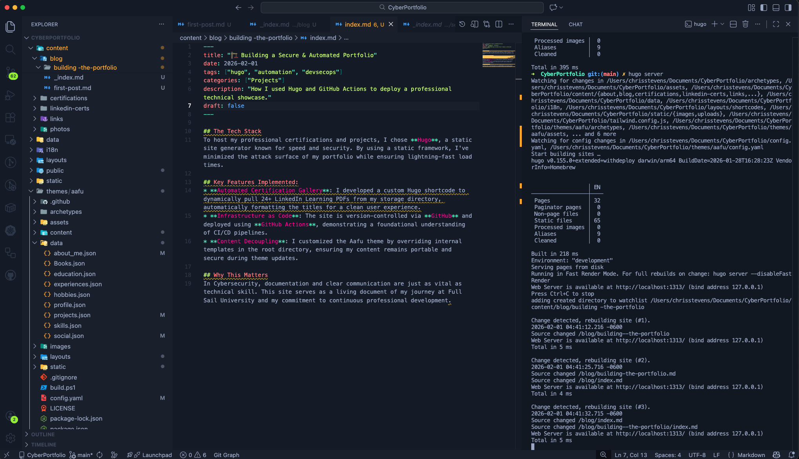

## The Tech Stack
To host my professional certifications and projects, I chose **Hugo**, a static site generator known for speed and security. By using a static framework, I've minimized the attack surface of my portfolio while ensuring lightning-fast load times.

## Key Features Implemented:
* **Automated Certification Gallery**: I developed a custom Hugo shortcode to dynamically pull 24+ LinkedIn Learning PDFs from my storage directory, automatically formatting the titles for a clean user experience.
* **Infrastructure as Code**: The site is version-controlled via **GitHub** and deployed using **GitHub Actions**, demonstrating a foundational understanding of CI/CD pipelines.
* **Content Decoupling**: I customized the Aafu theme by overriding internal templates in the root directory, ensuring my content remains portable and secure during theme updates.

## Why This Matters
In Cybersecurity, documentation and clear communication are just as vital as technical skill. This site serves as a living document of my journey at Full Sail University and my commitment to continuous professional development.

## The Build Process
Here is a look at my Hugo directory structure and the terminal during a successful build:

<figure>
  
  <figcaption align="center"><i>Fig 1: Behind the scenes in VS Code.</i></figcaption>
</figure>